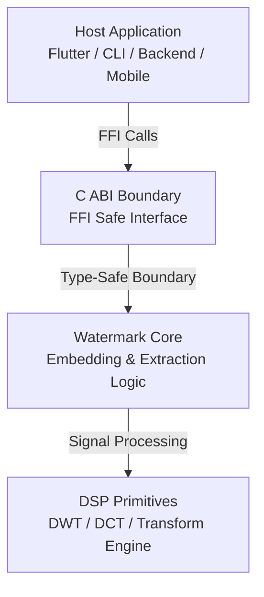
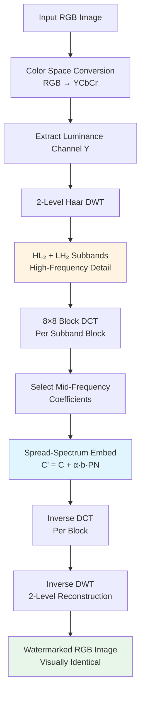
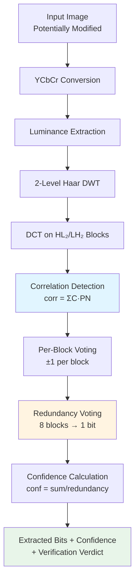
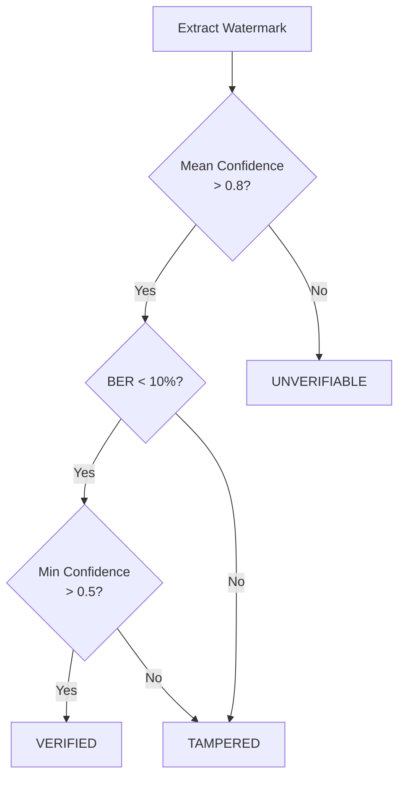

# Screenshot-Resilient Watermarking Core

> A research-grade, production-ready **C++ watermarking engine** with a stable C ABI, designed to survive screenshots and recompression while **intentionally breaking under cropping**.

---

## Table of Contents

1. [Executive Summary](#1-executive-summary)
2. [Threat Model & Design Philosophy](#2-threat-model--design-philosophy)
3. [Architecture Overview](#3-architecture-overview)
4. [Watermarking Pipeline](#4-watermarking-pipeline)
5. [Core Techniques](#5-core-techniques)
6. [C ABI Specification](#6-c-abi-specification)
7. [Block Geometry & Capacity](#7-block-geometry--capacity)
8. [Worked Example](#8-worked-example)
9. [Verification System](#9-verification-system)
10. [Memory & Ownership Model](#10-memory--ownership-model)
11. [Binary Distribution](#11-binary-distribution)
12. [Repository Structure](#12-repository-structure)
13. [Limitations & Roadmap](#13-limitations--roadmap)

---

## 1. Executive Summary

This repository contains the **core native implementation** of a screenshot-resilient, invisible image watermarking system. The project is designed as a **low-level, language-agnostic library** with a **stable C ABI**, suitable for integration into mobile apps, desktop software, and backend services via Foreign Function Interfaces (FFI).

### Key Characteristics

The watermark is embedded directly into the **image signal** (not metadata) and is engineered to:

- **Survive** screenshots, JPEG recompression (Q ≈ 70-95), and mild resizing
- **Withstand** display resampling and re-encoding
- **Fail deterministically** under cropping or structural tampering
- **Extract without** access to the original image
- **Produce** deterministic, explainable verification outcomes

---

## 2. Threat Model & Design Philosophy

### 2.1 Design Principles

This project follows a strict separation of concerns:

- **Signal Processing Core**: Implements all watermarking logic in C++
- **Stable C ABI**: Exposes a minimal, deterministic interface for external consumers
- **External Bindings**: Implemented in separate repositories (mobile, backend, CLI)
- **Primitive Library**: Treated similar to cryptographic or compression libraries

The core is versioned with ABI stability guarantees within major versions.

### 2.2 Supported Transformations

- Screenshots (display → resample → encode)
- JPEG recompression (Q ≈ 70-95)
- Mild noise and rescaling
- Display resampling variations

### 2.3 Intentionally Unsupported

- **Spatial cropping** (≈10-20% or more) - treated as tampering
- Perspective warps or heavy rotation
- Content removal or region editing
- Not rotation or perspective invariant

> **Design Principle:** If the spatial context of an image changes, its authenticity claim should fail. This is a feature, not a limitation.

---

## 3. Architecture Overview

### 3.1 Layer Architecture

The system is divided into **strict layers** to ensure correctness, portability, and testability.



### 3.2 Layer Responsibilities

| Layer           | Responsibility                                      | Language  |
|-----------------|-----------------------------------------------------|-----------|
| Application     | UI, file I/O, networking, product logic             | Any       |
| Public API      | Stable ABI, validation, error codes, memory safety  | C ABI     |
| Watermark Core  | Embedding, extraction, verification logic           | C++       |
| DSP Primitives  | DWT, DCT, numerical operations                      | C++       |

### 3.3 ABI Guarantees

- No C++ name mangling (`extern "C"`)
- No exceptions crossing the ABI boundary
- No STL types in public interfaces
- Caller-allocated memory only
- Deterministic, side-effect-free execution
- ABI considered **stable within a major version**

---

## 4. Watermarking Pipeline

### 4.1 Embedding Pipeline



### 4.2 Extraction Pipeline



### 4.3 Why This Pipeline?

- **YCbCr Space**: Human visual system more sensitive to luminance changes
- **DWT (Haar, 2-level)**: Separates image into perceptually meaningful frequency bands
- **HL₂/LH₂ Subbands**: Optimal trade-off between robustness and invisibility
- **DCT (8×8)**: Aligns with JPEG compression and screenshot processing pipelines
- **Mid-Frequency**: Survives compression better than high-frequency, less visible than low-frequency

---

## 5. Core Techniques

### 5.1 Spread-Spectrum Watermarking

Each watermark bit is embedded as a **low-energy, pseudo-random signal** across multiple frequency coefficients and blocks.

**Embedding Equation:**

```
C' = C + α · b · PN
```

Where:
- `C` = original DCT coefficient
- `C'` = watermarked coefficient
- `α` = embedding strength (perceptual tuning parameter)
- `b` = watermark bit value (±1)
- `PN` = pseudo-random noise sequence (deterministically generated from key)

**Detection via Correlation:**

```
correlation = Σ(C' · PN)
bit_estimate = sign(correlation)
confidence = |correlation| / num_coefficients
```

Detection is performed via **correlation analysis**, not thresholding, making it robust to signal degradation.

### 5.2 Redundancy & Error Resilience

- Each payload bit is embedded across **multiple blocks** (default: 8 blocks)
- Extraction uses **majority voting** across redundant embeddings
- Confidence computed as agreement ratio: `|votes_for_bit| / total_votes`
- High redundancy trades capacity for robustness

### 5.3 Keyed Pseudo-Random Permutation

- Block order is permuted using a **cryptographic PRNG** seeded with the key
- Different keys produce statistically independent watermarks
- Prevents unauthorized extraction or tampering
- Same key required for both embedding and extraction

---

## 6. C ABI Specification

### 6.1 Core Data Structures

#### Image Descriptor

Represents a single-channel luminance image.

```c
typedef struct {
    uint32_t width;
    uint32_t height;
    float* y;           // Luminance channel, range [0, 255]
} WM_Image;
```

**Memory ownership:** Caller allocates and manages the buffer.

#### Watermark Payload

Opaque bit payload embedded into the image.

```c
typedef struct {
    const int8_t* bits;  // Values must be +1 or -1
    uint32_t length;     // Number of bits
} WM_Payload;
```

**Semantic interpretation:** The core treats payload as pure signal data with no assumed meaning.

#### Extraction Result

Holds extracted watermark data and confidence metrics.

```c
typedef struct {
    int8_t* bits;            // Extracted bits (+1 / -1)
    float* confidence;       // Per-bit confidence in [0,1]
    uint32_t length;

    float mean_confidence;   // Average confidence across all bits
    float min_confidence;    // Weakest bit confidence

    WM_Verdict verdict;      // Overall verification outcome
} WM_ExtractResult;
```

### 6.2 Status Codes

All public functions return explicit status codes.

```c
typedef enum {
    WM_OK = 0,                      // Operation successful
    WM_ERR_INVALID_ARGUMENT,        // Null pointer or invalid parameter
    WM_ERR_INVALID_DIMENSIONS,      // Image size not supported
    WM_ERR_INSUFFICIENT_CAPACITY,   // Image too small for payload
    WM_ERR_INTERNAL,                // Internal processing error
    WM_ERR_UNVERIFIABLE             // Cannot verify watermark
} WM_Status;
```

**Important:** No function throws exceptions across the ABI boundary.

### 6.3 Verification Verdict

Extraction produces a structured verification outcome:

```c
typedef enum {
    WM_VERDICT_VERIFIED = 0,    // Watermark intact, image authentic
    WM_VERDICT_TAMPERED,        // Watermark destroyed (e.g., cropping)
    WM_VERDICT_UNVERIFIABLE     // Insufficient signal or wrong key
} WM_Verdict;
```

These states intentionally distinguish between:
- **Verified**: Watermark detected with sufficient confidence (typical: mean confidence > 0.8)
- **Tampered**: Watermark partially destroyed, indicating structural modification
- **Unverifiable**: No watermark detected, wrong key, or incompatible format

---

## 7. Block Geometry & Capacity

### 7.1 Dimensional Requirements

For an image of size **W × H**:

- **Required constraints:** `W % 32 == 0`, `H % 32 == 0`
- **HL₂ and LH₂ dimensions:** `(W/4) × (H/4)` pixels each
- **DCT blocks per band:** `(W/32) × (H/32)` blocks
- **Total usable blocks:** `2 × (W/32) × (H/32)`

### 7.2 Capacity Calculation

For a **512 × 512** image:

```
HL₂ blocks: (512/32) × (512/32) = 16 × 16 = 256 blocks
LH₂ blocks: (512/32) × (512/32) = 16 × 16 = 256 blocks
Total blocks: 512 blocks

Payload capacity (8× redundancy): 512 / 8 = 64 bits
Payload capacity (4× redundancy): 512 / 4 = 128 bits
```

### 7.3 Scaling Examples

| Image Size | Total Blocks | 8× Redundancy | 4× Redundancy |
|------------|--------------|---------------|---------------|
| 256×256    | 128          | 16 bits       | 32 bits       |
| 512×512    | 512          | 64 bits       | 128 bits      |
| 1024×1024  | 2048         | 256 bits      | 512 bits      |
| 2048×2048  | 8192         | 1024 bits     | 2048 bits     |

---

## 8. Worked Example

### 8.1 Scenario Setup

- **Image:** 512×512 RGB photograph
- **Payload:** 64-bit unique identifier
- **Key:** 64-bit secret key (0x1234567890ABCDEF)
- **Embedding strength (α):** 0.05

### 8.2 Embedding Process

1. **Convert** RGB → YCbCr color space
2. **Apply** 2-level Haar DWT on luminance (Y) channel
3. **Extract** HL₂ and LH₂ subbands (128×128 pixels each)
4. **Divide** into 8×8 DCT blocks (256 blocks per subband)
5. **Permute** block order using keyed PRNG
6. **Embed** each payload bit into 8 consecutive blocks
7. **Apply** inverse DCT to each block
8. **Reconstruct** via inverse DWT
9. **Convert** back to RGB

### 8.3 Quality Metrics (Clean Embedding)

- **PSNR:** ~60 dB (visually lossless)
- **SSIM:** >0.999
- **Bit Error Rate (BER):** 0% on extraction
- **Mean confidence:** ~1.0

### 8.4 Robustness Testing

#### Screenshot Test
- **Action:** Display on screen, screenshot at 100% scale
- **Result:** BER = 0%, Mean confidence = 0.95, **VERIFIED**

#### JPEG Recompression (Q=75)
- **Action:** Save as JPEG with quality 75
- **Result:** BER = 0-2%, Mean confidence = 0.87, **VERIFIED**

#### 20% Center Crop
- **Action:** Crop 20% from each edge
- **Result:** BER = 35-45%, Mean confidence = 0.3, **TAMPERED**

This fragility under cropping is **intentional design behavior**.

---

## 9. Verification System

### 9.1 Decision Logic



### 9.2 Confidence Thresholds

| Metric              | Threshold | Meaning                      |
|---------------------|-----------|------------------------------|
| Mean Confidence     | > 0.8     | Overall signal strength      |
| Min Confidence      | > 0.5     | Weakest bit still detectable |
| Bit Error Rate      | < 10%     | Acceptable degradation       |

### 9.3 Verification Policy (Critical)

The system reports **three states only** to avoid false positives and ambiguous claims:

- **VERIFIED:** Image is intact and authentic
- **TAMPERED:** Watermark destroyed by structural modification
- **UNVERIFIABLE:** Cannot make authenticity claim (wrong key, no watermark, or incompatible format)

---

## 10. Memory & Ownership Model

### 10.1 Ownership Rules

- **Caller allocates** all buffers
- **Library never frees** external memory
- **No hidden allocations** or global state
- **No dangling pointers** - all pointers remain valid during function call only

### 10.2 Safe FFI Pattern

```c
// Caller-owned memory
WM_Image image = {
    .width = 512,
    .height = 512,
    .y = (float*)malloc(512 * 512 * sizeof(float))
};

WM_Payload payload = {
    .bits = (int8_t[]){1, -1, 1, 1, ...},
    .length = 64
};

// Embed (modifies image.y in-place)
WM_Status status = wm_embed(&image, &payload, key, alpha);

// Caller responsible for cleanup
free(image.y);
```

These rules are critical for safe FFI integration across language boundaries.

---

## 11. Binary Distribution

### 11.1 Release Artifacts

Prebuilt binaries for supported platforms are distributed via **GitHub Releases**:

- `libwatermark-core-v1.0.0-linux-x64.so`
- `libwatermark-core-v1.0.0-macos-arm64.dylib`
- `libwatermark-core-v1.0.0-windows-x64.dll`
- `libwatermark-core-v1.0.0-android-arm64.so`
- `libwatermark-core-v1.0.0-ios-arm64.a`

### 11.2 Versioning Policy

- **Major version (X.0.0):** ABI-breaking changes
- **Minor version (1.X.0):** Backward-compatible enhancements
- **Patch version (1.0.X):** Bug fixes only

**Recommendation:** Pin dependencies to major version for ABI stability.

---

## 12. Repository Structure

```
watermark-core/
├── include/
│   └── wm/                    # Public C headers (ABI-safe)
│       ├── watermark          # Core Embed and Extract Interfaces
|       |── transform          # DSP interface
│       ├── types.h            # Data structures
│       ├── api.h              # Core API Interfaces
│      
├── src/
│   ├── watermark/
│   └── transform/
├── tests/
├── CMakeLists.txt
└── README.md
```

---

## 13. Limitations & Roadmap

### 13.1 Current Limitations (Intentional for v1)

- **No crop tolerance** - spatial modification breaks verification by design
- **Limited rotation invariance** - rotation > 5° may reduce confidence
- **No cryptographic proof binding** - future extension layer
- **Requires specific dimensions** - images must be multiples of 32px

### 13.2 Non-Functional Guarantees

- **Deterministic:** Same input + key → same output
- **Robust:** Survives screenshots & recompression
- **Fragile by design:** Cropping breaks verification
- **Portable:** No platform-specific dependencies (C++17 only)
- **FFI-ready:** C-compatible boundaries

### 13.3 Roadmap

#### Near-term
- Real mobile screenshot pipeline tests (iOS/Android)
- Dart/Flutter FFI bindings repository
- Performance benchmarks and optimization

#### Medium-term
- Enhanced error correction codes
- Alternative wavelet bases (Daubechies, CDF 9/7)
- Rotation-invariant variant (separate mode)

#### Long-term
- ZK-proof binding of extracted payload to identity
- Video watermarking extension
- GPU-accelerated processing
- Web Assembly build target

### 13.4 Extensibility Strategy

The core is designed to support future extensions while preserving ABI stability:

- New features introduced via optional function variants
- Major version bump only for breaking changes
- Feature flags for experimental capabilities

---

## 14. Public API Functions

### 14.1 Embed Watermark

```c
WM_Status wm_embed(
    WM_Image* image,           // Modified in-place
    const WM_Payload* payload,
    uint64_t key,              // Cryptographic key
    float alpha                // Embedding strength [0.01, 0.2]
);
```

**Returns:** `WM_OK` on success, error code otherwise

**Failure modes:**
- `WM_ERR_INVALID_DIMENSIONS` if image size not multiple of 32
- `WM_ERR_INSUFFICIENT_CAPACITY` if payload too large for image

### 14.2 Extract Watermark

```c
WM_Status wm_extract(
    WM_Image* image,           // Not modified
    uint64_t key,
    WM_ExtractResult* result   // Caller-allocated
);
```

**Returns:** `WM_OK` on success (even if verdict is TAMPERED)

**Note:** Does not modify input image, designed to fail cleanly on incompatible input

---

## 15. License & Usage

This repository provides the **core watermarking engine** only. This is the **authoritative implementation** of the watermarking primitive.

**Important Notes:**
- External packages should treat this core as immutable within major releases
- Licensing, attribution, and product-level policy must be defined before deployment
- This is intentionally **not a language-specific binding** - those belong in separate repositories

---
