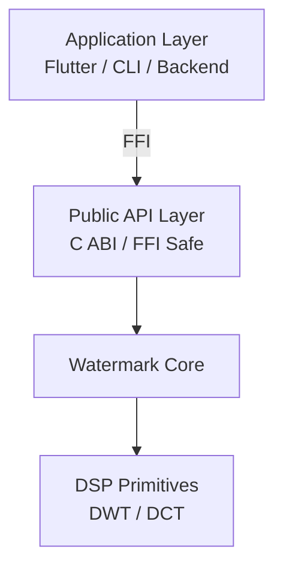
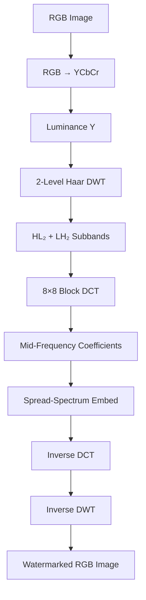
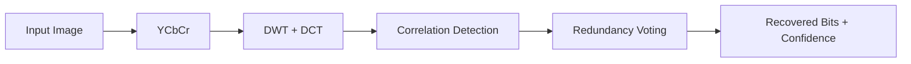

# Screenshot‑Resilient Watermarking Core

> A research‑grade, production‑ready **C++ watermarking engine** designed to survive screenshots and recompression while **intentionally breaking under cropping**.

---

## 1. Executive Summary

This repository implements a **deterministic, invisible, screenshot‑resilient image watermarking core** in modern C++. The watermark is embedded directly into the **image signal** (not metadata) using classical signal‑processing techniques that are robust to re‑encoding and resampling, while deliberately **failing under spatial cropping**.

**Design intent (v1):**

* Survive screenshots, JPEG recompression, and mild resizing
* Fail clearly and decisively when the image is cropped (treated as tampering)
* Produce deterministic, explainable verification outcomes
* Be portable via a clean C ABI (e.g., Flutter/Dart FFI)

This is not a heuristic watermark. It is a **controlled signal‑domain authentication mechanism**.

---

## 2. Threat Model & Design Philosophy

### Supported Transformations

* Screenshots (display → resample → encode)
* JPEG recompression (Q ≈ 70–95)
* Mild noise and rescaling

### Intentionally Unsupported

* Spatial cropping (≈10–20% or more)
* Perspective warps, heavy rotation
* Content removal or region editing

> **Principle:** If the spatial context of an image changes, its authenticity claim should fail.

---

## 3. High‑Level Architecture

The system is divided into **strict layers** to ensure correctness, portability, and testability.



### Layer Responsibilities

| Layer       | Responsibility                          |
| ----------- | --------------------------------------- |
| Application | UI, file I/O, networking, product logic |
| Public API  | Stable ABI, validation, error codes     |
| Core        | Watermark embedding & extraction        |
| DSP         | DWT, DCT, numerical primitives          |

---

## 4. End‑to‑End Pipeline

### 4.1 Embedding Pipeline



### 4.2 Extraction Pipeline



---

## 5. Core Techniques Explained

### 5.1 Why DWT + DCT?

* **DWT (Haar, 2‑level):** separates image into perceptually meaningful bands
* **HL₂ / LH₂:** optimal trade‑off between robustness and invisibility
* **DCT (8×8):** aligns with JPEG and screenshot processing

### 5.2 Spread‑Spectrum Watermarking

Each watermark bit is embedded as a **low‑energy, pseudo‑random signal** across multiple frequency coefficients and blocks:

```
C' = C + α · b · PN
```

Where:

* `C`  = original coefficient
* `b`  = watermark bit (±1)
* `PN` = pseudo‑random noise (keyed)
* `α`  = embedding strength

Detection is performed via **correlation**, not thresholding.

---

## 6. Block Geometry & Capacity (General Case)

For an image of size **W × H**:

* Requires: `W % 32 == 0`, `H % 32 == 0`
* HL₂ and LH₂ size: `(W/4) × (H/4)`
* DCT blocks per band: `(W/32) × (H/32)`
* Total usable blocks: `2 × (W/32) × (H/32)`

### Example: 512 × 512

* HL₂ blocks: 256
* LH₂ blocks: 256
* Total blocks: **512**
* Payload (v1): **64 bits**
* Redundancy: **8 blocks per bit**

---

## 7. Worked Example (Concrete Walkthrough)

### Input

* Image: 512×512 RGB photo
* Payload: 64‑bit opaque ID
* Key: 64‑bit private key

### Embedding

1. Convert RGB → YCbCr
2. Apply 2‑level Haar DWT on Y
3. Enumerate HL₂ + LH₂ blocks
4. Keyed permutation of blocks
5. Each bit embedded into 8 blocks
6. Inverse DCT → Inverse DWT → RGB

### Extraction

1. Same transforms applied
2. Correlation per block → ±1 votes
3. Majority vote per bit
4. Confidence = |sum| / redundancy

### Result (Clean Image)

* PSNR ≈ **60 dB**
* BER = **0**
* Mean confidence ≈ **1.0**

### Result (20% Crop)

* BER ≈ **0.4**
* Confidence collapses
* Verdict: **TAMPERED**

This behavior is **intentional**.

---

## 8. Verification Policy (Critical)

The system reports **three states only**:

| State        | Meaning                                  |
| ------------ | ---------------------------------------- |
| VERIFIED     | Image intact and authentic               |
| TAMPERED     | Watermark destroyed (e.g., crop)         |
| UNVERIFIABLE | Cannot make a claim (wrong key / format) |

This avoids false positives and ambiguous claims.

---

## 9. Repository Structure

```
watermark-core/
├── include/wm/            # Public headers (ABI‑safe)
│   ├── image.h
│   ├── watermark/
│   └── transform/
├── src/
│   ├── watermark/
│   └── transform/
├── tests/                # Unit & attack tests
└── examples/
```

---

## 10. Non‑Functional Guarantees

* **Deterministic:** same input + key → same output
* **Robust:** survives screenshots & recompression
* **Fragile by design:** cropping breaks verification
* **Portable:** no platform‑specific dependencies
* **FFI‑ready:** C‑compatible boundaries

---

## 11. Limitations (Intentional for v1)

* No crop tolerance
* Limited rotation invariance
* No cryptographic proof binding (future layer)

---

## 12. Roadmap

* Real mobile screenshot pipeline tests
* Dart / Flutter FFI bindings
* ZK‑proof binding of extracted payload
* Video watermark extension

---

## 13. License & Usage

This repository provides the **core watermarking engine** only. Licensing, attribution, and product‑level policy must be defined before external deployment.

---

## Final Note

This system is designed to answer one question reliably:

> **“Has this image remained visually and spatially intact since capture?”**

If the answer is not a confident *yes*, verification fails deliberately.
